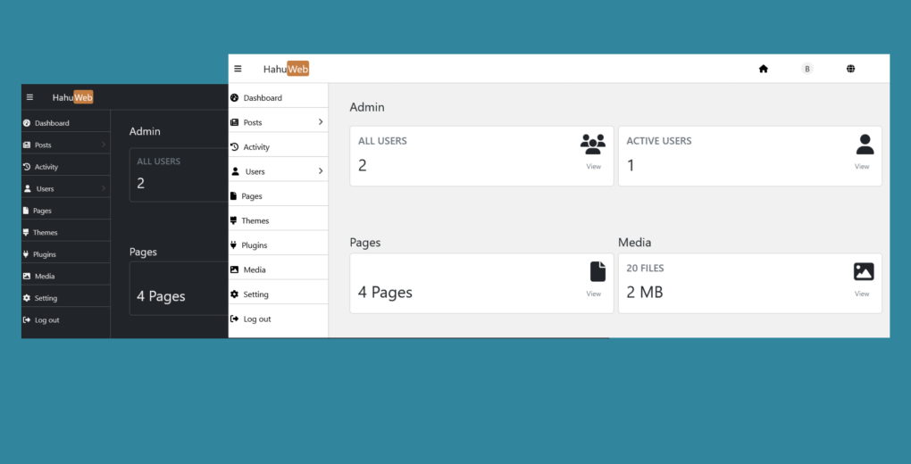

# Hahu Web

<h4 calign="center">
	
	  
	<strong>Create awesome website easily.</strong>
</h4>

  <a href="https://hahuweb.netlify.app/">Website</a> |

### Features

* Build modern and responsive websites based on Bootstrap and jQuery.
* You can use your websites for blogging purpose.
* Manage your website from any device.
* Easy to configure and use.

## Plugins

* Vvveb: Drag and drop website builder.
* Contact From: Received message from your website visitors.
* Limit Login: Limit login attempt for admin users.
* PHP Mailer: Send emails safely and easily via PHP code from a web server.

More plugins coming soon.

## Installation for Local

* Unzip the package and move to webserver directory.
* Create database that you used on Hahu CMS.
* Open hw-admin/ in your browser. It will take you through the process to set up a config.php file with your     database connection details.
* Once the configuration file is set up, the installer will set up the tables needed for your site.
* The installer should then send you to the login page.
* Create admin account done.

## System Requirements

<ul>
<li><b>PHP</b> version 5.6.20 or greater.</li>
<li><b>MySQL</b> version 5.0 or greater.</li>
</ul>

## License

Apache 2.0
